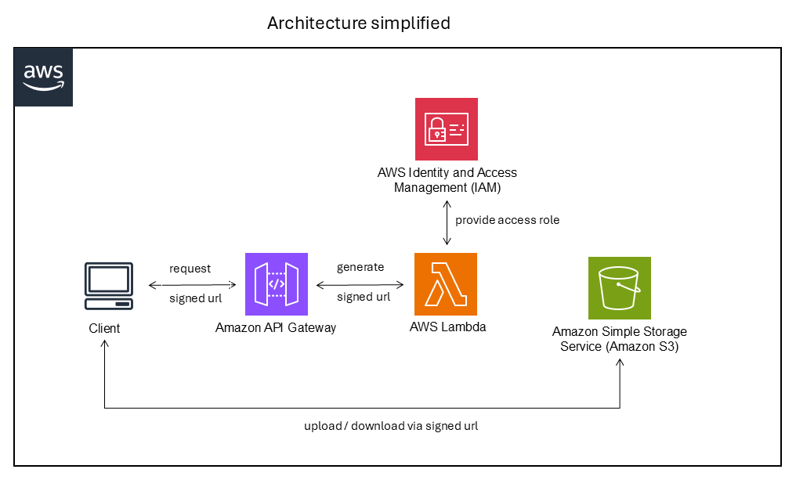

# Guide de Déploiement de l'Infrastructure AWS

## Vue d'ensemble

Ce document décrit l'infrastructure AWS pour le site de démonstration FracSYS et fournit les instructions pour le déployer à l'aide d'AWS CDK (Cloud Development Kit).

## Architecture

L'infrastructure AWS fournit un accès sécurisé aux fichiers de modèles 3D stockés dans Amazon S3 via des URL présignées. L'architecture se compose de :



### Composants

1. **Bucket Amazon S3** (`fracsys-models-20251127`)
   - Bucket privé avec Block Public Access activé
   - Stocke les fichiers de modèles 3D (format GLTF/GLB)
   - Chiffrement SSL/TLS obligatoire
   - Versioning désactivé

2. **Fonctions AWS Lambda**
   - **Signed URL Handler** : Génère des URL présignées pour télécharger des modèles depuis S3
   - **Upload URL Handler** : Génère des URL présignées pour téléverser des modèles vers S3
   - Runtime : Python 3.12
   - Timeout : 10 secondes
   - Variables d'environnement :
     - `BUCKET_NAME` : Nom du bucket S3
     - `DEFAULT_EXPIRES_SECONDS` : Durée d'expiration par défaut (3600 secondes = 1 heure)

3. **Amazon API Gateway**
   - API REST avec CORS activé
   - Deux endpoints :
     - `GET /signed-url` : Demander des URL de téléchargement
     - `GET /upload-url` : Demander des URL de téléversement
   - Les sorties CloudFormation fournissent les URL des endpoints de l'API

## Utilisation de l'API

### Endpoint URL de Téléchargement

Demander une URL présignée pour télécharger un modèle :

```
GET https://{api-id}.execute-api.{region}.amazonaws.com/prod/signed-url?key={object-key}&expires={seconds}
```

**Paramètres de requête :**
- `key` (obligatoire) : Clé d'objet S3 (chemin du fichier dans le bucket)
- `expires` (optionnel) : Durée d'expiration de l'URL en secondes (défaut : 3600, max : 86400)

**Réponse :**
```json
{
  "bucket": "fracsys-models-20251127",
  "key": "path/to/model.glb",
  "expires_in": 3600,
  "signedUrl": "https://fracsys-models-20251127.s3.amazonaws.com/..."
}
```

### Endpoint URL de Téléversement

Demander une URL présignée pour téléverser un modèle :

```
GET https://{api-id}.execute-api.{region}.amazonaws.com/prod/upload-url?key={object-key}&contentType={mime-type}&expires={seconds}
```

**Paramètres de requête :**
- `key` (obligatoire) : Clé d'objet S3 (chemin de destination dans le bucket)
- `contentType` (optionnel) : Type MIME (défaut : `application/octet-stream`)
- `expires` (optionnel) : Durée d'expiration de l'URL en secondes (défaut : 3600, max : 86400)

**Réponse :**
```json
{
  "bucket": "fracsys-models-20251127",
  "key": "path/to/model.glb",
  "expires_in": 3600,
  "contentType": "model/gltf-binary",
  "uploadUrl": "https://fracsys-models-20251127.s3.amazonaws.com/..."
}
```

## Prérequis

Avant de déployer la stack CDK, assurez-vous d'avoir :

1. **Compte AWS** avec les permissions appropriées
2. **AWS CLI** installé et configuré
   ```bash
   aws configure
   ```
3. **Node.js** (v14 ou ultérieur) pour l'interface CLI d'AWS CDK
4. **Python 3.12** ou ultérieur
5. **CLI AWS CDK** installée globalement
   ```bash
   npm install -g aws-cdk
   ```

## Instructions de Déploiement

### 1. Naviguer vers le Répertoire de la Stack CDK

```bash
cd aws-cdk-stack
```

### 2. Créer et Activer l'Environnement Virtuel

**Sur macOS/Linux :**
```bash
python3 -m venv .venv
source .venv/bin/activate
```

**Sur Windows :**
```bash
python -m venv .venv
.venv\Scripts\activate.bat
```

### 3. Installer les Dépendances

```bash
pip install -r requirements.txt
```

### 4. Bootstrap CDK (Première Fois Uniquement)

Si c'est la première fois que vous utilisez CDK dans votre compte/région AWS :

```bash
cdk bootstrap
```

Cela crée les ressources nécessaires dans votre compte AWS pour les déploiements CDK.

### 5. Examiner le Template CloudFormation

Avant de déployer, vous pouvez examiner le template CloudFormation généré :

```bash
cdk synth
```

### 6. Déployer la Stack

Déployer l'infrastructure vers AWS :

```bash
cdk deploy
```

Vous serez invité à approuver les changements liés à la sécurité. Examinez-les et approuvez pour continuer.

### 7. Noter les Sorties

Après un déploiement réussi, CDK affichera les endpoints de l'API Gateway :

```
Outputs:
S3SignedUrlAccessStack.SignedUrlDownloadEndpoint = https://{api-id}.execute-api.{region}.amazonaws.com/prod/signed-url
S3SignedUrlAccessStack.SignedUrlUploadEndpoint = https://{api-id}.execute-api.{region}.amazonaws.com/prod/upload-url
```

Sauvegardez ces URL pour les utiliser dans votre application.

## Mise à Jour de la Stack

Après avoir apporté des modifications au code CDK :

1. Examiner les changements :
   ```bash
   cdk diff
   ```

2. Déployer les mises à jour :
   ```bash
   cdk deploy
   ```

## Commandes CDK Utiles

- `cdk ls` - Lister toutes les stacks de l'application
- `cdk synth` - Synthétiser le template CloudFormation
- `cdk deploy` - Déployer la stack vers AWS
- `cdk diff` - Comparer la stack déployée avec l'état actuel
- `cdk destroy` - Supprimer la stack d'AWS
- `cdk docs` - Ouvrir la documentation CDK

## Considérations de Sécurité

1. **Bucket S3 Privé** : Tout accès public est bloqué. L'accès n'est possible que via des URL présignées.
2. **Chiffrement SSL/TLS Obligatoire** : Toutes les connexions à S3 doivent utiliser HTTPS.
3. **URL à Durée Limitée** : Les URL présignées expirent après le temps spécifié (max 24 heures).
4. **Configuration CORS** : Actuellement configurée pour autoriser toutes les origines (`*`). Pour la production, limitez cela à votre domaine spécifique :
   ```python
   allow_origins=["https://votredomaine.com"]
   ```
5. **Permissions Lambda** : Les fonctions Lambda n'ont que des permissions de lecture sur le bucket S3.

## Estimation des Coûts

L'infrastructure utilise les services AWS suivants avec des coûts :

- **S3** : Coûts de stockage basés sur le volume de données et les requêtes
- **Lambda** : Paiement par invocation et temps d'exécution
- **API Gateway** : Paiement par appel API
- **CloudWatch Logs** : Coûts de stockage des logs

Pour un site de démonstration avec un trafic modéré, le coût devrait rester dans les limites du niveau gratuit AWS.

## Dépannage

### Le Déploiement Échoue

- Assurez-vous que les identifiants AWS sont correctement configurés
- Vérifiez que vous avez les permissions IAM nécessaires
- Vérifiez que le nom du bucket est unique globalement

### Erreurs CORS

- Vérifiez la configuration CORS de l'API Gateway
- Vérifiez que les fonctions Lambda renvoient les en-têtes CORS appropriés

### L'URL Présignée Retourne 403

- Vérifiez que l'objet existe dans le bucket S3
- Vérifiez que la fonction Lambda a des permissions de lecture sur le bucket
- Assurez-vous que l'URL n'a pas expiré

## Support

Pour les problèmes ou questions, veuillez ouvrir un ticket sur le dépôt du projet.
